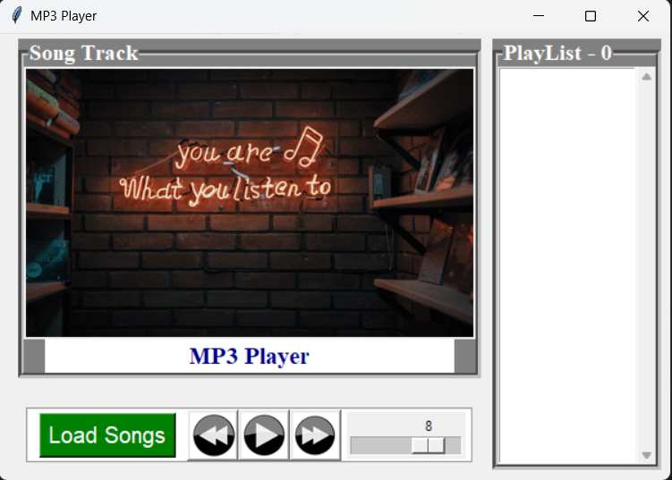
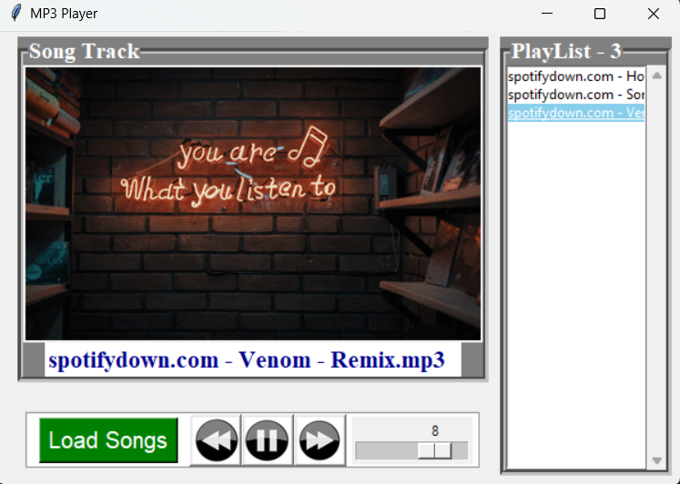

# **MP3 Player**

<p align = "center"></p>

This project is a python tkinter based music player which you can use to
play controlled music while programming

# Python Version

## Python 3

# Dependencies

- PyGame

    ```
    pip install pygame
    ```

# Set-Up ⚒️

<p align = "center"></p>

- Ensure you have the latest stable version of [Python 3](https://www.python.org/downloads/) in your system

- Open your terminal / command prompt

- Clone the repository 
    ```
    git clone https://github.com/Julian-Idl/MP3-Player.git
    ```
- Change the directory to the cloned project
    
    ```
    cd MP3-Player
    ```
# Usage

- Run the following command in terminal / command prompt
    ```
    python application.pyw
    ```

### Shortcut Keys

- Left arrow key : play the previous song
- Right arrow key : play the next song
- Space key : Play / Pause Music

# Demo 👇

**v.0.0.1 (Graphical User Interface Default Preview)**


<p align = "center"></p>


**v.0.0.1 (Graphical User Interface With A Song Playing)**

<p align = "center"></p>

# Note ✏️

- Feel free to contact me in my  [](https://julian-idl.codes)

# Author

Made with ♥ by [`Julian-Idl`](https://julian-idl.codes) 